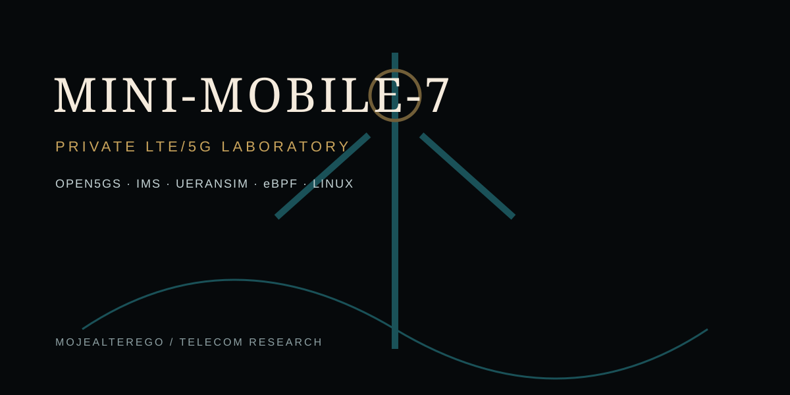
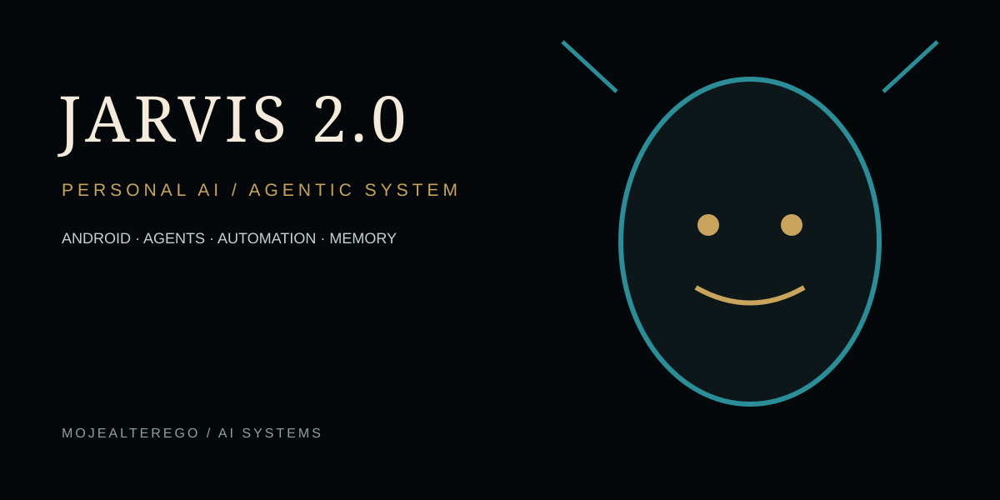
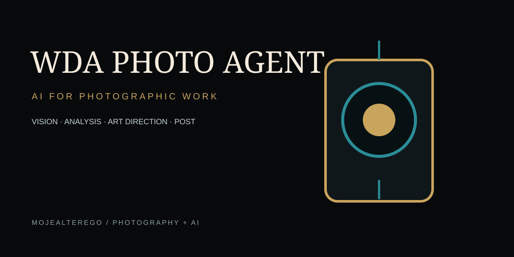
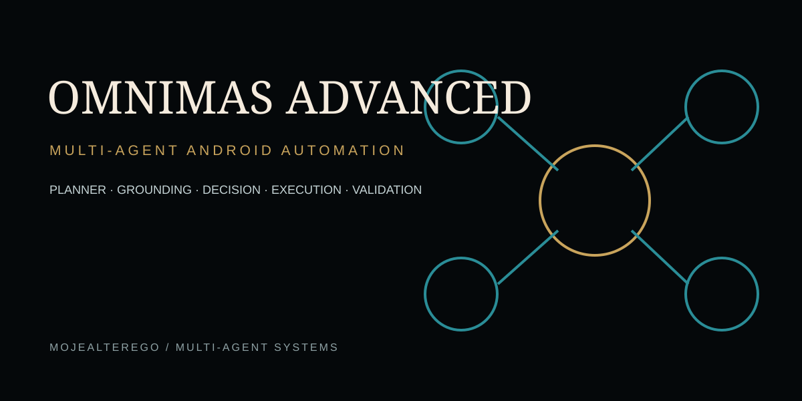
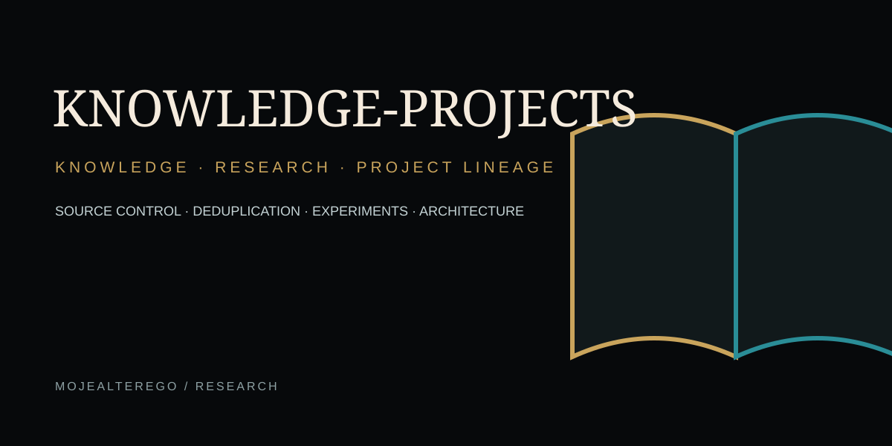
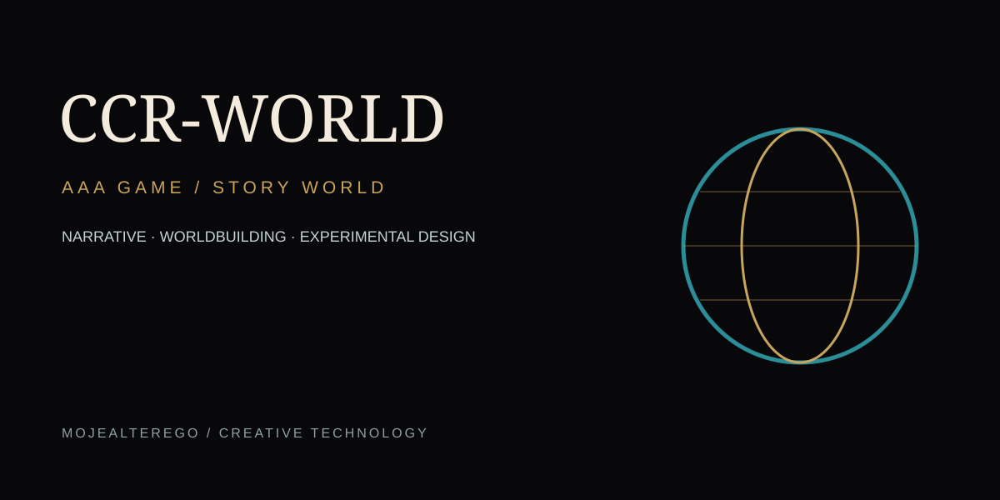
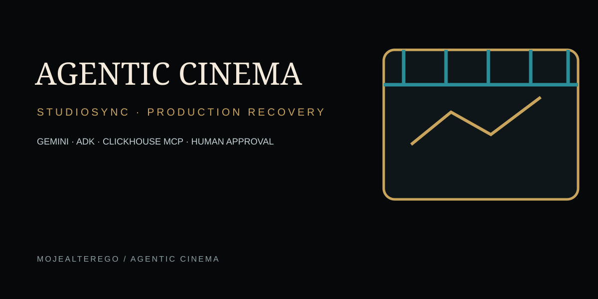
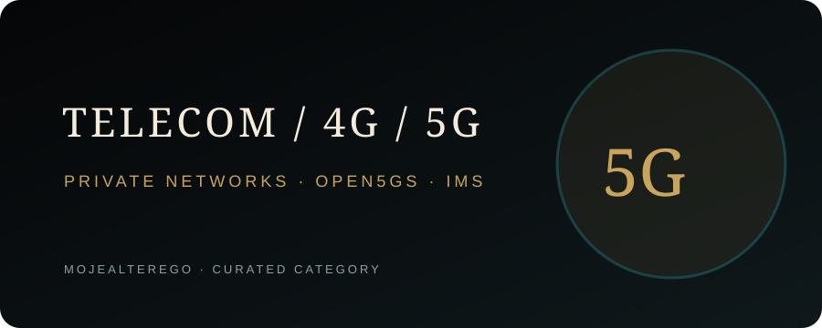

# MOJEALTEREGO

### FOTOGRAF · TWÓRCA AI · INŻYNIER · BADACZ · OBSERWATOR

**Obserwuję. Tworzę. Eksperymentuję.**

[WEBSITE](https://mojealterego.github.io/) · [REPOSITORIES](https://github.com/mojealterego?tab=repositories)

---

## 01 · KIM JESTEM

Łączę fotografię dokumentalną, opowiadanie historii, technologię i eksperyment.

**MojeAlterego** to ekosystem projektów obejmujący sztuczną inteligencję, agentów, MCP, Android, prywatne sieci, badania, fotografię, film i publikowanie.

> „Rzeczywistość to dopiero początek…”

---

## 02 · OBSZARY

| | Obszar | Zakres |
|---|---|---|
| 🧠 | **AI & AGENTS** | agenci AI, systemy wieloagentowe, LLM, automatyzacja |
| 🔌 | **MCP & INFRASTRUCTURE** | serwery, integracje, narzędzia i workflow |
| 📱 | **MOBILE & ANDROID** | Android, ADB, aplikacje i lokalne AI |
| 📡 | **TELECOM / 4G / 5G** | prywatne LTE/5G, Open5GS, IMS, eBPF |
| 🔬 | **RESEARCH & R&D** | prototypy, wiedza techniczna, eksperymenty |
| 📷 | **PHOTOGRAPHY & ART** | fotografia dokumentalna, portret, obraz |
| 📚 | **BOOKS & PUBLISHING** | książki, światy narracyjne, projekty wydawnicze |
| ⚙️ | **TOOLS & EXPERIMENTS** | biblioteki, skrypty, narzędzia i POC |

---

## 03 · SELECTED PROJECTS

### MINI-MOBILE-7

**Private LTE/5G laboratory and private cellular network blueprint for up to 7 controlled devices.**

[Repository](https://github.com/mojealterego/mini-mobile-7)

---

### JARVIS 2.0

**Real Android AI assistant project with mobile client, authenticated backend and EAS build pipeline.**

[Repository](https://github.com/mojealterego/JARVIS-2.0)

---

### WDA PHOTO AGENT

**AI-assisted photographic workflow: source → analysis → art direction → execution → verification.**

[Repository](https://github.com/mojealterego/wda-photo-agent)

---

### OMNIMAS ADVANCED

**Multi-agent Android automation architecture with planning, grounding, decision, execution, memory and validation layers.**

[Repository](https://github.com/mojealterego/OmniMAS-Advanced)

---

### KNOWLEDGE-PROJECTS

**Research and project lineage repository focused on source control, knowledge synthesis and architecture evolution.**

[Repository](https://github.com/mojealterego/Knowledge-projects)

---

### CCR-WORLD

**Experimental AAA game / story-world repository.**

[Repository](https://github.com/mojealterego/CCR-WORLD)

---

### AGENTIC CINEMA

**StudioSync — agentic production recovery for film and media, with evidence-aware decision support and human approval gates.**

[Repository](https://github.com/mojealterego/Agentic-Cinema-The-Blockbuster-Hackathon)

---

---

## 03A · VISUAL INDEX

<table>
<tr><td></td><td></td></tr>
<tr><td></td><td></td></tr>
<tr><td></td><td></td></tr>
<tr><td></td><td></td></tr>
</table>

## 04 · TECHNOLOGY

`Python` · `Kotlin` · `Android` · `Linux` · `Docker` · `Open5GS` · `IMS` · `eBPF` · `PostgreSQL` · `React` · `Next.js` · `OpenAI` · `MCP` · `GitHub Actions`

---

## 05 · HUMAN × MACHINE

**HUMAN**

Fotografia · film · literatura · obserwacja rzeczywistości

**MACHINE**

AI · agenci · MCP · aplikacje · sieci · automatyzacja · narzędzia

**POMIĘDZY NIMI POWSTAJE MOJEALTEREGO.**

---

## 06 · TWÓRCZOŚĆ

Fotografia dokumentalna · portret · street photography · fotoreportaż · film · książki · projekty artystyczne

---

## 07 · LICZBY

**2000+** nagród, wyróżnień i akceptacji  
**300+** wystaw zbiorowych  
**40+** krajów prezentacji prac  
**16** wystaw indywidualnych  
**75 000+** członków społeczności fotograficznej

---

## 08 · DISCOVERY

### GitHub
[All repositories](https://github.com/mojealterego?tab=repositories)

### Website
[MojeAlterego](https://mojealterego.github.io/)

### Photography
[Fotografia](https://fotografiauliczna.pl/)

---

## 09 · BRAND & GOVERNANCE

- [GitHub Lists taxonomy](./docs/LISTS.md)
- [Visual identity system](./docs/VISUAL_SYSTEM.md)
- [Repository README standard](./docs/REPOSITORY_README_TEMPLATE.md)
- [Deployment plan](./docs/DEPLOYMENT.md)

**Presentation rule:** visuals explain the work; they do not replace evidence. Real screenshots, real repository facts and verified status take precedence over decorative claims.

---

**IDEAS · PEOPLE · TECHNOLOGY · ART**

### A BETTER TOMORROW

