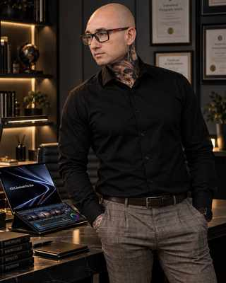

# MOJEALTEREGO

### ANDRZEJ MIKULSKI · FOTOGRAF · FOTOREPORTER · AUTOR · TWÓRCA

**Obserwuję. Tworzę. Eksperymentuję.**

[STRONA WWW](https://mojealterego.github.io/) · [WSZYSTKIE REPOZYTORIA](https://github.com/mojealterego?tab=repositories)

---

## O MNIE

Urodzony w Warszawie fotograf, fotoreporter i autor książek. Od 2023 roku mieszkam i tworzę na Śląsku Cieszyńskim. Łączę pracę górnika z fotoreportażem dla Agencji Fotograficznej REPORTER. Fotografuję przede wszystkim codzienność, ludzi i relacje; interesują mnie również film, informatyka i nowe technologie.

Założyłem i administruję społecznością **Fotografia Uliczna** (ponad 75 000 członków) oraz jestem jurorem portalu Flog.pl. Moje prace były prezentowane w Polsce i za granicą, a wybrane prace znajdują się w kolekcji FIAP.

## DOROBEK

| 16 | 300+ | 40+ | 2000+ | 75 000+ |
|---:|---:|---:|---:|---:|
| wystaw indywidualnych | wystaw zbiorowych | krajów | nagród, wyróżnień i akceptacji | członków społeczności |

### Tytuły i działalność

- AFRP Artysta Fotograf Rzeczypospolitej Polski (2017),
- AFIAP Międzynarodowy tytuł Artysty Fotografa (2019),
- EFIAP Międzynarodowy tytuł Wybitnego Artysty Fotografa (2020) (1 z 50 w historii Polski)
- Członek rzeczywisty Fotoklubu RP
- Członek zarządu Cieszyńskiego Towarzystwa Fotograficznego
- Członek PLAMA Łęczna
- Fotoferia Club

### Wybrane wyróżnienia

- 2023 — Złoty Medal Rzeczypospolitej Polski „Za Fotograficzną Twórczość”
- 2019 — Srebrny Medal Rzeczypospolitej Polski „Za Zasługi dla Polskiej Fotografii”
- 2018 — Brązowy Medal Rzeczypospolitej Polski „Za Fotograficzną Twórczość”
- Człowiek Roku Powiatu Cieszyńskiego — 2023 i 2024
- Człowiek Roku Powiatu Łęczyńskiego — 2017 i 2018

### Książki i publikacje

*Człowiek Roku* · Tetralogia CCR Tom I: Jak przeżyć w dziwnym świecie po przeniesieniu się do alternatywnej osi czasu, Tom II: Oś czasu w alternatywnych światach, Tom III: Ludzie Roku Oś 18 świadomości, Tom IV: Architektura Nieskończoności · *Światło które zostało* · *Baśń o Pornlandi* · *Cieszyn Noir* · *Ontologia Liczby i Geometrii* · komiks *Druga połowa*

> „Rzeczywistość to dopiero początek…”

---

## OBSZARY TWÓRCZOŚCI I BUDOWANIA

<table>
<tr>
<td align="center" width="25%"> <b>FOTOGRAFIA I SZTUKA</b> Dokument · portret · street</td>
<td align="center" width="25%"> <b>KSIĄŻKI I PUBLISHING</b> Literatura · światy narracyjne</td>
<td align="center" width="25%"> <b>AI I AGENCI</b> Asystenci · systemy wieloagentowe</td>
<td align="center" width="25%"> <b>MCP I INFRASTRUKTURA</b> Integracje · workflow</td>
</tr>
<tr>
<td align="center"> <b>MOBILE I ANDROID</b> Aplikacje · Kotlin</td>
<td align="center"> <b>TELEKOMUNIKACJA</b> Prywatne LTE/5G · IMS</td>
<td align="center"> <b>RESEARCH & R&amp;D</b> Prototypy · dokumentacja</td>
<td align="center"> <b>NARZĘDZIA I EKSPERYMENTY</b> Automatyzacja · testy</td>
</tr>
</table>

---

## WYBRANE PROJEKTY

Poniższe odnośniki prowadzą do repozytoriów. Opisy określają temat projektu, nie deklarują jego gotowości produkcyjnej.

| Projekt | Zakres | Repozytorium |
|---|---|---|
| MINI-MOBILE-7 | Prywatne laboratorium sieci LTE/5G | [Otwórz](https://github.com/mojealterego/mini-mobile-7) |
| Knowledge-projects | Baza wiedzy i archiwum projektów | [Otwórz](https://github.com/mojealterego/Knowledge-projects) |
| Nowe-projekty | Kolekcja nowych koncepcji i prac | [Otwórz](https://github.com/mojealterego/Nowe-projekty) |

Pełna, aktualna lista: [github.com/mojealterego](https://github.com/mojealterego?tab=repositories).

---

## HUMAN × MACHINE

**HUMAN** — fotografia · film · literatura · obserwacja rzeczywistości  
**MACHINE** — AI · agenci · MCP · aplikacje · sieci · automatyzacja

### POMIĘDZY NIMI POWSTAJE MOJEALTEREGO.

**IDEAS · PEOPLE · TECHNOLOGY · ART**

### A BETTER TOMORROW

