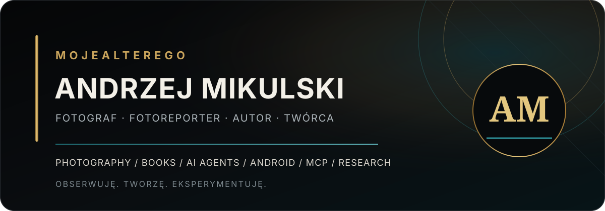

# Andrzej Mikulski / MojeAlterego

**Fotograf · fotoreporter · autor · twórca systemów i eksperymentów technologicznych**

> **Obserwuję. Tworzę. Eksperymentuję.**  
> Łączę obraz, narrację i technologię — od fotografii dokumentalnej i książek po AI, agentów, Androida i MCP.

**[STRONA WWW](https://mojealterego.github.io/)** · **[REPOZYTORIA](https://github.com/mojealterego?tab=repositories)** · **[STATUSY PROJEKTÓW](./docs/PROJECT-STATUS.md)**

---

## Profil

Urodzony w Warszawie fotograf, fotoreporter i autor książek. Od 2023 roku mieszkam i tworzę na Śląsku Cieszyńskim. Łączę pracę górnika z fotoreportażem dla Agencji Fotograficznej REPORTER. Fotografuję codzienność, ludzi i relacje; równolegle rozwijam projekty z obszaru filmu, informatyki, sztucznej inteligencji i automatyzacji.

Założyłem i administruję społecznością **Fotografia Uliczna** liczącą ponad **75 000 członków**. Mój dorobek obejmuje **16 wystaw indywidualnych**, ponad **300 wystaw zbiorowych** i prezentacje prac w ponad **40 krajach**.

| **16** | **300+** | **40+** | **2000+** | **75 000+** |
|---:|---:|---:|---:|---:|
| wystaw indywidualnych | wystaw zbiorowych | krajów | nagród, wyróżnień i akceptacji | członków społeczności |

**AFRP** 2017 · **AFIAP** 2019 · **EFIAP** 2020 · Członek rzeczywisty Fotoklubu RP · Członek zarządu Cieszyńskiego Towarzystwa Fotograficznego · Juror Flog.pl

---

## Ekosystem MojeAlterEgo

| HUMAN | BRIDGE |
|---|---|
| **Photography** — dokument, street, portret, fotoreportaż, wystawy i publikacje. | **AI** — modele językowe, multimodalność, reasoning, pamięć i narzędzia. |
| **Books** — książki, komiks, autorskie uniwersa i projekty wydawnicze. | **Agents** — planowanie, grounding, wykonanie, walidacja i human approval. |
| **Film / narrative** — obraz, opowieść, trailery i eksperymenty audiowizualne. | **Android** — aplikacje mobilne, lokalne modele i automatyzacja urządzeń. |
| **Research** — analiza, prototypowanie i testowanie hipotez. | **MCP / Infrastructure** — integracje narzędzi, gatewaye i systemy wykonawcze. |

### Książki i światy autorskie

*Człowiek Roku* · tetralogia *CCR* · *Światło które zostało* · *Baśń o Pornlandi* · *Cieszyn Noir* · *Ontologia Liczby i Geometrii* · komiks *Druga połowa*

### Zasada techniczna

**Kod > deklaracja.** Funkcja opisana jako działająca powinna mieć implementację, konfigurację, test albo inny weryfikowalny rezultat. Status projektu nie jest automatycznie podnoszony przez generator katalogu.

---

## Flagowe projekty

Katalog jest generowany z kontrolowanego manifestu `.github/project-catalog.json`. Automatyzacja odświeża metadane, ale **nie może samodzielnie promować dojrzałości projektu**.

<!-- PROJECT_CATALOG:START -->
| Project | Domain | Status | Primary language | Last activity | Scope |
|---|---|---|---|---|---|
| [`mini-mobile-7`](https://github.com/mojealterego/mini-mobile-7) | Research / Telecom | **PROTOTYPE** | Shell | 2026-10-04 | Private LTE/5G network for up to 7 devices |
| [`JARVIS-2.0`](https://github.com/mojealterego/JARVIS-2.0) | Android / AI / Agents | **PROTOTYPE** | TypeScript | 2026-10-04 | JARVIS 2.0 - Real Android AI Assistant |
| [`wda-photo-agent`](https://github.com/mojealterego/wda-photo-agent) | Photography / AI / Agents | **BETA** | TypeScript | 2026-10-04 | Mobile-oriented AI art-direction and postproduction pipeline using OpenAI and Adobe services. |
| [`OmniMAS-Advanced`](https://github.com/mojealterego/OmniMAS-Advanced) | Android / AI / Agents | **PROTOTYPE** | Kotlin | 2026-10-04 | Android automation architecture with local LLM planning, accessibility grounding and a security gate. |
| [`Knowledge-projects`](https://github.com/mojealterego/Knowledge-projects) | Research | **RESEARCH** | JavaScript | 2026-10-04 | Research, knowledge synthesis and project-registry repository. |
| [`CCR-WORLD`](https://github.com/mojealterego/CCR-WORLD) | Books / Android / Creative Technology | **CONCEPT** | — | 2026-10-04 | AAA Android game concept connected to the CCR creative universe. |
| [`Agentic-Cinema-The-Blockbuster-Hackathon`](https://github.com/mojealterego/Agentic-Cinema-The-Blockbuster-Hackathon) | AI / Agents / MCP | **PROTOTYPE** | Python | 2026-10-04 | StudioSync — agentic production-recovery prototype for film and media. |
| [`AURELIS-AI`](https://github.com/mojealterego/AURELIS-AI) | AI / Agents / Web | **PROTOTYPE** | TypeScript | 2026-10-04 | Premium conversational intelligence workspace; quality gate remediation remains open. |
<!-- PROJECT_CATALOG:END -->

---

## Statusy i wiarygodność

<strong>PRODUCTION / BETA / PROTOTYPE / RESEARCH / CONCEPT — kryteria</strong>

| Status | Znaczenie |
|---|---|
| **PRODUCTION** | Zweryfikowane wdrożenie produkcyjne, działający build/deploy i wymagane bramki jakości. |
| **BETA** | Zintegrowany i testowalny system; część bramek produkcyjnych pozostaje otwarta. |
| **PROTOTYPE** | Działający lub częściowo działający demonstrator wymagający dalszej integracji. |
| **RESEARCH** | Repo badawcze, eksperymentalne lub wiedzy; bez deklaracji gotowego produktu. |
| **CONCEPT** | Koncepcja lub specyfikacja bez wystarczająco zweryfikowanej implementacji. |

Pełna polityka: [docs/PROJECT-STATUS.md](./docs/PROJECT-STATUS.md).

<strong>Jak czytać moje repozytoria</strong>

Każdy projekt powinien rozdzielać:

1. to, co istnieje w kodzie,
2. to, co zostało uruchomione lub przetestowane,
3. plan lub hipotezę,
4. otwarte ograniczenia i zależności.

Wspólny standard README: [docs/FLAGSHIP-README-STANDARD.md](./docs/FLAGSHIP-README-STANDARD.md).

---

## Profil GitHub ≠ strona WWW

`mojealterego/mojealterego` jest **profilem GitHub i indeksem ekosystemu**. Właściwa strona WWW jest rozwijana osobno w repozytorium [`mojealterego/mojealterego.github.io`](https://github.com/mojealterego/mojealterego.github.io).

---

**HUMAN × MACHINE**

**IDEAS · PEOPLE · TECHNOLOGY · ART**

### A BETTER TOMORROW

